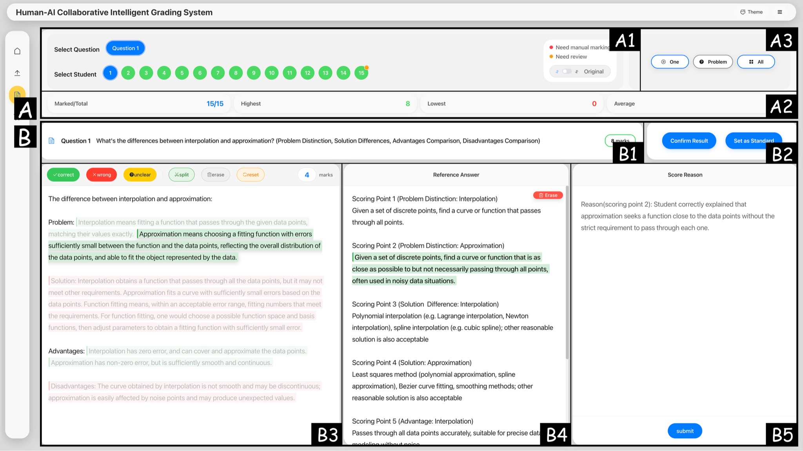

# VeriGrader: Open-ended Structured Question Assessment with Human-LLM Collaboration (CHI '26)

<p align="left">
  <a href="https://doi.org/10.1145/3772318.3791034"></a>
  <a href="LICENSE"></a>
</p>

Official implementation of **“Open-ended Structured Question Assessment with Human-LLM Collaboration”**, accepted at [ACM CHI 2026](https://doi.org/10.1145/3772318.3791034).

## Overview

VeriGrader is a human-LLM collaborative system for grading open-ended structured questions (OSQs). It uses an LLM to divide each student response into fine-grained pieces, align them with reference scoring points, classify them as correct, wrong, or unclear, and generate grading rationales. Instructors can inspect and revise these results through linked response, answer, and rationale views, then reuse confirmed results as few-shot examples for subsequent grading.

<p align="center">
  
</p>

<p align="center"><em>VeriGrader's coordinated interface for point-level inspection and correction.</em></p>

## Contributions

- We conduct stakeholder interviews and analyze graded exam papers to distill the grading practices and then compile requirements of human–AI collaboration for OSQ assessment.
- We develop a prototype system, VeriGrader, the first system supporting instructor-LLM collaborative OSQ grading. VeriGrader frees instructors from tedious manual response segmentation, scoring point mapping, and semantic judgment, while retaining their agency to inspect, correct grading results, and guide LLMs, thus achieving credible, reliable, consistent, and efficient OSQ grading.
- Empirical validation of VeriGrader in real-world educational contexts, demonstrating its advantages in grading efficiency, accuracy, consistency, and instructor agency, alongside an exploration of future potential and directions for transparent AI support in high-stakes assessment and beyond.

## Implementation

VeriGrader is implemented as a browser-based application using Vue 3, TypeScript, Vite, Pinia, and Element Plus. It communicates with an OpenAI-compatible LLM endpoint and stores working data locally in the browser.

The main workflow is:

1. Upload OSQs, reference answers with scoring points, and student responses; initial LLM grading starts automatically after validation.
2. The LLM segments and classifies response pieces and generates rationales.
3. Review the response, matched scoring point, and rationale in coordinated panels.
4. Correct or confirm results and save selected cases as few-shot exemplars.
5. Regrade selected responses and export the final results.

A fully synthetic upload example and the accepted JSON schemas are available in [`examples/`](examples/README.md).

To run the prototype locally:

```bash
cd frontend
npm install
cp .env.example .env
npm run dev
```

Configure the following variables in `frontend/.env`:

```dotenv
VITE_API_KEY=your-api-key
VITE_API_URL=https://your-openai-compatible-endpoint/v1/chat/completions
```

Model names and generation settings can be changed in `frontend/src/config/api.ts`. Because this research prototype calls the LLM endpoint from the browser, use it locally and do not deploy it publicly with a real API key.

## Citation

If you find this work useful, please cite:

```bibtex
@inproceedings{lin2026verigrader,
  author    = {Lin, Fengyan and Lin, Yanna and Cao, Kai and Deng, Zikun and Cai, Yi},
  title     = {Open-ended Structured Question Assessment with Human-LLM Collaboration},
  booktitle = {Proceedings of the 2026 CHI Conference on Human Factors in Computing Systems},
  series    = {CHI '26},
  pages     = {1--21},
  publisher = {ACM},
  year      = {2026},
  doi       = {10.1145/3772318.3791034}
}
```
