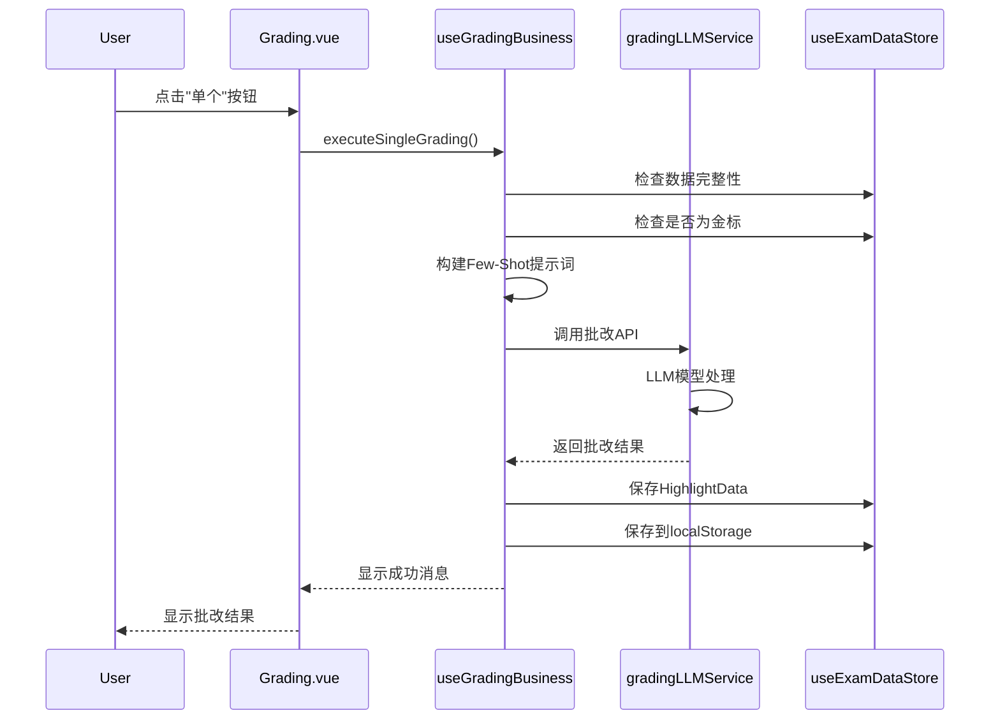
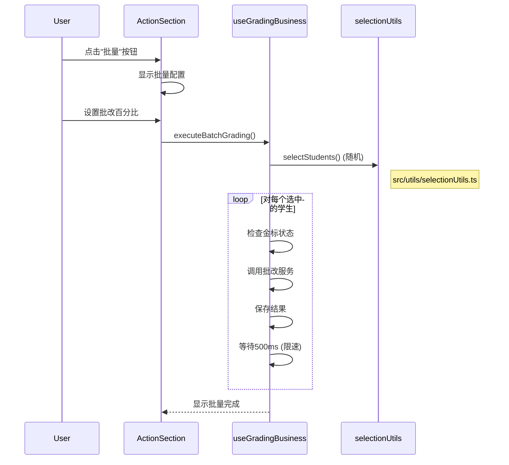
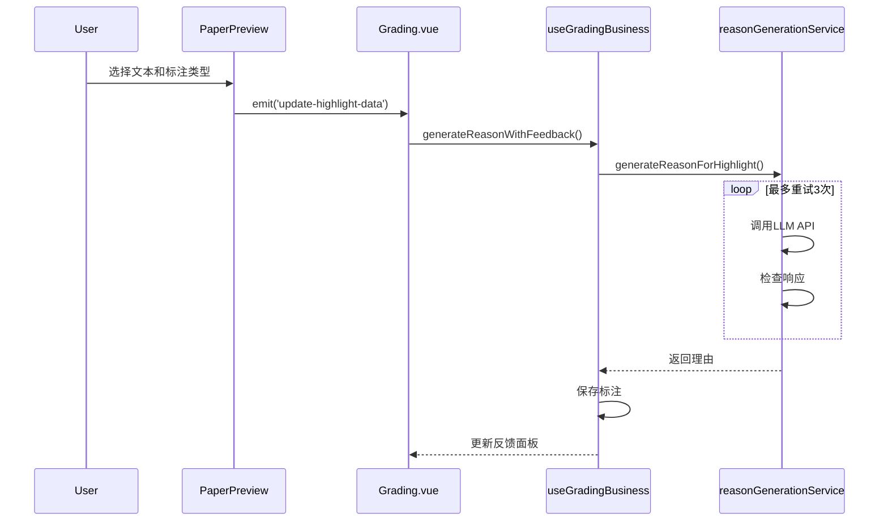
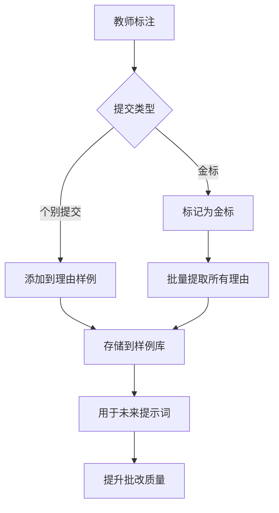

# LLM 考试批改系统 - 开发指南

## 目录

1. [系统概览](#系统概览)
2. [架构设计](#架构设计)
3. [数据模型](#数据模型)
4. [核心工作流程](#核心工作流程)
5. [目录结构](#目录结构)
6. [开发指南](#开发指南)
7. [API 集成](#api集成)
8. [状态管理](#状态管理)
9. [错误处理](#错误处理)
10. [测试与调试](#测试与调试)

## 系统概览

LLM 考试批改系统是一个基于 Vue 3 + TypeScript 的应用程序，使用大语言模型自动批改学生试卷，同时提供教师监督和 Few-Shot 学习功能。

### 核心功能

- **自动批改**: 使用 LLM API 进行 AI 智能试卷批改
- **教师标注**: 手动高亮和理由标注功能
- **Few-Shot 学习**: 金标试卷和理由样例库系统
- **批量处理**: 同时批改多份试卷
- **实时反馈**: 标注时实时生成理由
- **数据持久化**: 本地存储所有批改数据

### 技术栈

- **前端**: Vue 3 + TypeScript + Element Plus
- **状态管理**: Pinia
- **构建工具**: Vite
- **LLM 集成**: OpenAI 兼容 API
- **存储**: LocalStorage + JSON 文件

## 目录结构

```
│frontend/src/
├── components/
│   ├── grading/                              # 主批改界面
│   │   ├── Grading.vue                       # 根协调器组件
│   │   ├── ActionSection.vue                 # 批改操作控制
│   │   ├── FeedbackPanel.vue                 # 理由显示和编辑
│   │   ├── GradingHeader.vue                 # 学生/题目导航
│   │   ├── HighlightToolbar.vue              # 标注工具
│   │   ├── PaperPreview.vue                  # 文本显示和高亮
│   │   ├── ReferenceAnswer.vue               # 参考答案显示
│   │   └── ScoringSection.vue                # 分数输入和金标
│   ├── layout/                               # 应用布局组件
│   │   ├── MainLayout.vue                    # 主布局容器
│   │   ├── AppHeader.vue                     # 应用顶部导航栏
│   │   ├── AppSidebar.vue                    # 侧边导航栏
│   │   └── menuConfig.ts                     # 菜单配置文件
│   ├── result/                               # 结果展示界面
│   │   ├── AnalysisPage.vue                  # 数据分析页面
│   │   ├── PaperViewer.vue                   # 试卷查看器
│   │   └── ReportPage.vue                    # 批改报告页面
│   ├── upload/                               # 文件上传界面
│   │   ├── Uploading.vue                     # 主容器组件 (核心业务逻辑)
│   │   ├── BaseUpload.vue                    # 基础上传组件 (通用UI)
│   │   ├── PaperUpload.vue                   # 试卷上传组件 (事件转发)
│   │   ├── AnswerUpload.vue                  # 参考答案上传组件 (事件转发)
│   │   ├── StudentUpload.vue                 # 学生答案上传组件 (事件转发)
│   │   └── Preview.vue                       # 预览弹窗组件 (内容展示)
│   ├── Home.vue                              # 首页组件
│   ├── PromptSetting.vue                     # 提示词设置组件
│   └── Result.vue                            # 结果页面入口组件
├── composables/                              # 业务逻辑层
│   ├── useGradingBusiness.ts                 # 核心批改操作
│   ├── useFewShotManager.ts                  # Few-Shot学习管理
│   ├── useHighlightDataOperations.ts         # 标注操作
│   └── useErrorHandler.ts                    # 错误处理工具
├── services/                                 # 外部服务集成
│   ├── llm/                                  # LLM服务层
│   │   │── grading/                          # 批改专用服务
│   │   │   ├── gradingLLMService.ts          # 主批改API
│   │   │   ├── reasonGenerationService.ts    # 理由生成API
│   │   │   └── gradingPrompts.ts             # 批改提示词构建器
│   │   └── upload/
│   │       ├── uploadLLMService.ts           # 上传生成API
│   │       └── uploadPrompts.ts              # 上传提示词构建器
│   │
│   └── file/                                 # 文件处理服务
├── stores/                       	      # 状态管理
│   ├── useExamDataStore.ts       	      # 核心考试数据
│   └── useUploadStatusStore.ts   	      # 上传状态跟踪
├── utils/                        	      # 通用工具函数
│   ├── highlightUtils.ts         	      # 文本高亮逻辑
│   ├── selectionUtils.ts         	      # 学生选择算法
│   ├── logger.ts                 	      # 统一日志工具
│   └── textUtils.ts              	      # 文本处理工具
├── config/                       	      # 配置文件
│   ├── api.ts                    	      # API配置
│   └── prompt.json               	      # 静态提示词模板
└── types/                       	      # TypeScript类型定义
```

## 架构设计

### 分层架构

```
┌─────────────────────────────────────────────────────────┐
│                     表现层                               │
├─────────────────────────────────────────────────────────┤
│  Vue组件                              	                 │
│  - Grading.vue (主协调器) 															 │
│  - ActionSection.vue (控制面板)                          │
│  - FeedbackPanel.vue (理由显示)                          │
│  - PaperPreview.vue (文本标注)                           │
│  - GradingHeader.vue (导航栏)                            │
├─────────────────────────────────────────────────────────┤
│                    业务逻辑层                             │
├─────────────────────────────────────────────────────────┤
│  组合式函数                                               │
│  - useGradingBusiness.ts (核心批改逻辑)                   │
│  - useFewShotManager.ts (学习系统)                       │
│  - useHighlightDataOperations.ts (标注操作)              │
│  - useErrorHandler.ts (错误管理)                         │
├─────────────────────────────────────────────────────────┤
│                     服务层                               │
├─────────────────────────────────────────────────────────┤
│  LLM服务                                                 │
│  - gradingLLMService.ts (主批改API)                      │
│  - reasonGenerationService.ts (理由生成)                 │
│  - gradingPrompts.ts (提示词构建器)                       │
├─────────────────────────────────────────────────────────┤
│                     数据层                               │
├─────────────────────────────────────────────────────────┤
│  状态管理                                                │
│  - useExamDataStore.ts (核心数据存储)                     │
│  - useUploadStatusStore.ts (上传状态)            				 │
│  - localStorage (持久化)                                 │
└─────────────────────────────────────────────────────────┘
```

### 组件关系 Grading.vue (根协调器)

├── GradingHeader.vue (学生/题目导航)
├── ScoringSection.vue (分数输入 & 金标)
├── ActionSection.vue (批改控制)
├── PaperPreview.vue (文本显示 & 标注)
├── HighlightToolbar.vue (标注工具)
├── ReferenceAnswer.vue (参考答案显示)
└── FeedbackPanel.vue (理由显示 & 编辑)

## 数据模型

### 核心接口

```typescript
// 题目数据结构
interface Question {
  question_id: number;
  question: string;
  score: number;
}

// 学生答案数据
interface StudentAnswer {
  student_id: number;
  question_id: number;
  answer: string;
}

// 参考答案数据
interface ReferenceAnswer {
  question_id: number;
  answer: string;
}

// 高亮标注项
interface HighlightItem {
  "Student answer": string;
  "Scoring point": number;
  reason: string;
}

// 主要批改结果结构
interface HighlightData {
  student_id: number;
  question_id: number;
  answer: {
    correct: HighlightItem[]; // 正确要点
    wrong: HighlightItem[]; // 错误要点
    unclear: HighlightItem[]; // 模糊要点
    redundant: HighlightItem[]; // 冗余要点
  };
  total_score: number;
  isGold?: boolean; // 金标标记
}

// Few-Shot学习样例
interface ReasonExample {
  questionId: number;
  studentAnswer: string;
  highlightType: "correct" | "wrong" | "unclear" | "redundant";
  reason: string;
}
```

### 数据存储结构

```typescript
// LocalStorage键值和数据类型
const STORAGE_STRUCTURE = {
  'exam_questions': Question[],
  'exam_reference_answers': ReferenceAnswer[],
  'exam_student_answers': StudentAnswer[],
  'exam_student_list': StudentInfo[],
  'exam_highlight_data': HighlightData[],
  'exam_reason_examples': ReasonExample[]
}
```

## 核心工作流程

### 1. 单份试卷批改流程



### 2. 批量批改流程



### 3. 理由生成流程



### 4. Few-Shot 学习系统



## 开发指南

### 1. 工具函数重构 (最新)

**工具函数统一化：** 工具函数统一迁移到 `src/utils/` 目录，提供更好的代码组织和复用性：

```typescript
// 新的统一工具结构
src/utils/
├── highlightUtils.ts      // 文本高亮处理（从 components/grading/utils/ 迁移）
├── selectionUtils.ts      // 学生选择算法（从 components/grading/utils/ 迁移）
├── logger.ts              // 统一日志工具（新增）
└── textUtils.ts           // 文本处理工具（新增）
```

**工具函数详细说明：**

- **highlightUtils.ts**: 高亮算法、HTML 生成、颜色配置等
- **selectionUtils.ts**: 随机学生选择、验证、统计等算法
- **logger.ts**: 结构化日志、开发环境检测、批改专用日志方法
- **textUtils.ts**: 文本截取、预览生成、格式化等通用文本操作

**导入路径更新：**

```typescript
// 新的导入方式
import { generateHighlightedHTML } from "@/utils/highlightUtils";
import { selectStudents } from "@/utils/selectionUtils";
import { logger, gradingLogger } from "@/utils/logger";
import { previewText, truncateText } from "@/utils/textUtils";
```

**重构的优势：**

1. **更好的代码组织**: 所有工具函数集中管理，避免分散在组件中
2. **提升复用性**: 工具函数可以被任何组件和服务使用，不限于特定组件
3. **便于维护**: 统一的位置便于查找、修改和测试工具函数
4. **减少依赖**: 组件不再依赖特定路径下的工具函数
5. **标准化日志**: 所有 console.log 调用都通过统一的 logger 工具处理

**迁移指南：**

如果您正在更新现有代码，请按以下步骤进行：

1. 更新所有导入语句到新的 `@/utils/` 路径
2. 将直接的 `console.log` 调用替换为 `logger.*` 方法
3. 使用 `textUtils` 中的方法进行文本处理，而不是内联实现
4. 删除组件内部重复的工具函数实现

### 2. 代码重构优化 (最新)

**已完成的重构优化:**

- 抽取通用 LLM API 调用服务 (`baseLLMService.ts`)
- 统一批改执行逻辑 (`executeGradingForStudent`)
- 统一错误处理使用 (`useErrorHandler`)
- 工具函数重构：移动到 `src/utils/` 目录
- 统一日志系统：新增 `logger.ts` 替代直接 console 调用
- 文本处理工具：新增 `textUtils.ts` 统一文本操作

**代码质量提升:**

- 减少 200+行重复代码
- 工具函数统一管理：从组件内嵌移至 `src/utils/`
- 日志系统标准化：统一使用 `logger.ts` 替代散乱的 console 调用
- 文本处理规范化：所有文本截取、格式化操作统一到 `textUtils.ts`
- 统一注释风格 (`//` 单行注释)
- 修复所有 TypeScript 类型错误
- 提高代码可维护性和可读性

### 2. 添加新功能

在批改系统中添加新功能时：

1. **定义数据模型**: 在相应的 store 中从 TypeScript 接口开始
2. **创建服务层**: 在 services 目录中添加 API 调用，使用统一的 `baseLLMService`
3. **实现业务逻辑**: 使用组合式函数实现可复用逻辑
4. **构建 UI 组件**: 创建具有清晰 prop 接口的 Vue 组件
5. **添加错误处理**: 使用统一的 `useErrorHandler`
6. **更新状态管理**: 为新数据需求扩展 store

### 3. 组件开发模式

```typescript
// 标准组件结构
<template>
  <!-- 组件模板 -->
</template>

<script setup lang="ts">
// 1. 导入
import { computed, ref } from 'vue'
import { useExamDataStore } from '@/stores/useExamDataStore'

// 2. Props和Emits
interface Props {
  // 用类型定义props
}
const props = defineProps<Props>()

const emits = defineEmits<{
  (e: 'eventName', data: any): void
}>()

// 3. 组合式函数
const examStore = useExamDataStore()

// 4. 响应式状态
const localState = ref<any>()

// 5. 计算属性
const computedValue = computed(() => {
  // 计算逻辑
})

// 6. 方法
const handleAction = () => {
  // 方法实现
}

// 7. 生命周期钩子 (如需要)
onMounted(() => {
  // 初始化逻辑
})
</script>

<style scoped>
/* 组件样式 */
</style>
```

### 4. 状态管理模式

```typescript
// Store结构示例
export const useFeatureStore = defineStore("feature", () => {
  // 1. 状态
  const data = ref<DataType[]>([]);

  // 2. Getters (计算属性)
  const filteredData = computed(() => data.value.filter((item) => item.active));

  // 3. Actions
  const addItem = (item: DataType) => {
    data.value.push(item);
    saveToLocal(); // 变更后总是保存
  };

  const updateItem = (id: number, updates: Partial<DataType>) => {
    const index = data.value.findIndex((item) => item.id === id);
    if (index >= 0) {
      data.value[index] = { ...data.value[index], ...updates };
      saveToLocal();
    }
  };

  // 4. 持久化
  const saveToLocal = () => {
    localStorage.setItem("feature_data", JSON.stringify(data.value));
  };

  const loadFromLocal = () => {
    const saved = localStorage.getItem("feature_data");
    if (saved) {
      data.value = JSON.parse(saved);
    }
  };

  return {
    // 状态
    data,
    // Getters
    filteredData,
    // Actions
    addItem,
    updateItem,
    saveToLocal,
    loadFromLocal,
  };
});
```

### 5. 服务层模式

```typescript
// 现在使用统一的baseLLMService
import { callLLMAPI, getGradingConfig } from "../baseLLMService";

export async function serviceFunction(
  request: RequestType
): Promise<ResponseType> {
  try {
    // 1. 验证输入
    if (!validateRequest(request)) {
      throw new Error("无效的请求数据");
    }

    // 2. 构建提示词
    const prompt = buildPrompt(request);

    // 3. 调用统一LLM API
    const llmResponse = await callLLMAPI(prompt, getGradingConfig());

    if (!llmResponse.success) {
      throw new Error(llmResponse.error || "LLM API调用失败");
    }

    // 4. 转换并返回
    return transformResponse(llmResponse.content);
  } catch (error) {
    console.error("服务调用失败:", error);
    throw error;
  }
}
```

## API 集成

### 1. 统一的 LLM API 服务

现在所有 LLM API 调用都通过 `baseLLMService.ts`统一处理：

```typescript
// 统一API调用
import {
  callLLMAPI,
  getGradingConfig,
  getReasonGenerationConfig,
} from "./baseLLMService";

// 批改服务
const gradingResponse = await callLLMAPI(prompt, getGradingConfig());

// 理由生成服务
const reasonResponse = await callLLMAPI(prompt, getReasonGenerationConfig());
```

### 2. API 配置结构

```typescript
export const API_CONFIG = {
  LLM: {
    API_KEY: import.meta.env.VITE_API_KEY,
    API_URL: import.meta.env.VITE_API_URL,
    GRADING: { MODEL: "o3-mini", MAX_TOKENS: 4096, TEMPERATURE: 0.3 },
    REASON_GENERATION: { MODEL: "o3-mini", MAX_TOKENS: 150, TEMPERATURE: 0.3 },
  },
};
```

### 3. 提示词工程

系统使用结构化提示词进行不同操作：

- **批改提示词**: 试卷批改的 JSON 结构化响应
- **理由生成提示词**: 标注解释的文本响应
- **Few-Shot 提示词**: 包含示例推理的增强提示词

```typescript
// 提示词构建模式
export function buildPrompt(
  question: Question,
  referenceAnswer: ReferenceAnswer,
  studentAnswer: StudentAnswer,
  fewShotExamples?: string
): string {
  return `
    ${ROLE_DEFINITION}
  
    ${TASK_DESCRIPTION}
  
    题目: ${question.question}
    参考答案: ${referenceAnswer.answer}
  
    ${fewShotExamples || ""}
  
    学生答案: ${studentAnswer.answer}
  
    ${OUTPUT_FORMAT_INSTRUCTIONS}
  `;
}
```

### 4. 响应处理（已简化）

```typescript
// 现在响应处理在baseLLMService中统一处理
const llmResponse = await callLLMAPI(prompt, config);

if (llmResponse.success) {
  // 批改响应 - 解析JSON
  const gradingResult = JSON.parse(llmResponse.content!);

  // 理由响应 - 直接使用文本
  const reason = llmResponse.content!.trim();
} else {
  throw new Error(llmResponse.error);
}
```

## 状态管理

### 数据流原则

1. **单一数据源**: 所有考试数据存储在 `useExamDataStore`中
2. **响应式更新**: store 数据变化时 UI 自动更新
3. **持久化**: 所有变更自动保存到 localStorage
4. **不可变更新**: 更新状态时总是创建新对象

### Store 交互模式

```typescript
// 从store读取
const examStore = useExamDataStore();
const currentStudent = computed(() =>
  examStore.getStudentAnswer(studentId, questionId)
);

// 写入store
const updateGradingResult = (result: HighlightData) => {
  examStore.addHighlightData(result);
  // Store自动保存到localStorage
};

// 计算派生数据
const gradingProgress = computed(() => ({
  total: examStore.studentList.length,
  graded: examStore.highlightDataList.filter(
    (data) => data.question_id === currentQuestionId.value
  ).length,
}));
```

## 错误处理

### 错误分类

```typescript
enum ErrorType {
  GRADING = "grading", // LLM批改失败
  REASON_GENERATION = "reason_generation", // 理由生成失败
  DATA_VALIDATION = "data_validation", // 输入验证错误
  SERVICE_UNAVAILABLE = "service_unavailable", // API服务错误
  NETWORK = "network", // 网络连接问题
}
```

### 错误处理模式

```typescript
// 服务级错误处理
try {
  const result = await gradingService.grade(request);
  return { success: true, data: result };
} catch (error) {
  console.error("批改失败:", error);
  return {
    success: false,
    error: error.message,
    type: ErrorType.GRADING,
  };
}

// 组件级错误处理
const handleGradingError = (error: Error, context: string) => {
  // 记录用于调试
  console.error(`错误在 ${context}:`, error);

  // 显示用户友好消息
  ElMessage.error(getErrorMessage(error));

  // 必要时重置UI状态
  resetLoadingState();
};
```

### 重试机制

```typescript
// LLM调用的重试模式
async function callWithRetry<T>(
  operation: () => Promise<T>,
  maxRetries: number = 3,
  delay: number = 1000
): Promise<T> {
  for (let attempt = 1; attempt <= maxRetries; attempt++) {
    try {
      return await operation();
    } catch (error) {
      if (attempt === maxRetries) {
        throw error;
      }

      console.log(`重试 ${attempt}/${maxRetries} 在 ${delay}ms 后`);
      await new Promise((resolve) => setTimeout(resolve, delay));
    }
  }

  throw new Error("所有重试都失败了");
}
```

## 测试与调试

### 统一日志系统

系统现在使用统一的日志工具 (`src/utils/logger.ts`) 替代直接的 console.log 调用：

```typescript
// 统一日志工具使用
import { logger, gradingLogger } from "@/utils/logger";

// 基础日志方法
logger.info("操作信息", { 数据: "详细信息" });
logger.success("操作成功");
logger.error("操作失败", error);
logger.warn("警告信息");

// 批改专用日志组
gradingLogger.startSingle(studentId, questionId);
gradingLogger.preCheck({ 数据完整性: true, FewShot状态: "有示例" });
gradingLogger.gradingSuccess({ 总分: 85 });
gradingLogger.end();
```

### 日志系统特性

- **开发环境自动检测**: 只在开发环境输出日志
- **结构化分组**: 使用 `logger.group()` 和 `logger.groupEnd()` 组织日志
- **批改专用方法**: `gradingLogger` 提供批改流程专用的日志方法
- **数据安全**: 自动检测敏感信息，避免在生产环境泄露
- **性能优化**: 生产环境零开销，避免不必要的字符串拼接

### 日志分类

- **gradingLogger.startSingle()**: 单份试卷批改操作
- **gradingLogger.startBatch()**: 批量批改操作
- **gradingLogger.startReasonGeneration()**: 理由生成过程
- **logger.saved()**: 数据存储操作
- **logger.retry()**: 重试操作记录

### 实用工具示例

**logger.ts 使用示例：**

```typescript
import { logger, gradingLogger } from "@/utils/logger";

// 基础日志记录
logger.info("数据加载完成", { 学生数量: 45, 题目数量: 10 });
logger.success("批改成功");
logger.error("API调用失败", error);
logger.warn("数据可能不完整");

// 批改专用日志（带分组）
gradingLogger.startSingle(123, 1);
gradingLogger.preCheck({
  数据完整性: true,
  FewShot状态: "有3个示例",
  是否重新批改: false,
});
gradingLogger.gradingSuccess({
  总分: 85,
  标注统计: { 正确: 3, 错误: 1, 不清楚: 0, 冗余: 1 },
});
gradingLogger.end();
```

**textUtils.ts 使用示例：**

```typescript
import { previewText, truncateText, formatTextForLog } from "@/utils/textUtils";

// 文本预览（常用30字符）
const preview = previewText("这是一个很长的学生答案，包含很多详细的解释...");
// 结果: "这是一个很长的学生答案，包含很多详细的解释..."

// 自定义长度截取
const customText = truncateText("长文本内容", 50);

// 日志专用格式化
const logText = formatTextForLog(studentAnswer, 25);
logger.info("处理学生答案", { 答案预览: logText });
```

### 调试指南

1. **启用控制台日志**: 检查浏览器控制台中的详细操作日志
2. **监控网络**: 使用浏览器开发者工具监控 API 调用
3. **检查 LocalStorage**: 验证浏览器存储中的数据持久化
4. **验证状态**: 使用 Vue 开发者工具检查组件状态
5. **测试错误场景**: 用无效输入验证错误处理

### 常见调试点

```typescript
// 现在使用统一日志工具进行调试:

// 1. 服务入口点
export async function gradingService(request) {
  logger.info('服务调用开始', { 参数概览: request }) // 统一日志
  // ... 服务逻辑
}

// 2. 状态变更
const addHighlightData = (data) => {
  logger.saved(`高亮数据已添加`) // 专用方法
  // ... 变更逻辑
}

// 3. 错误边界
} catch (error) {
  logger.error('操作失败', error) // 统一错误日志
  // ... 错误处理
}

// 4. API响应
const response = await fetch(url, options)
logger.success('API调用成功', { 状态码: response.status }) // 结构化记录
```

### 性能监控

```typescript
// 为关键操作添加性能跟踪
const startTime = performance.now();
await performOperation();
const endTime = performance.now();
console.log(`操作耗时 ${endTime - startTime}ms`);
```

## 开发工作流程

### 1. 设置开发环境

```bash
# 安装依赖
npm install

# 启动开发服务器
npm run dev

# 构建生产版本
npm run build
```

### 2. 环境配置

创建 `.env.local`文件：

```env
VITE_API_KEY=你的openai_api_key
VITE_API_URL=https://api.openai.com/v1/chat/completions
```

### 3. 代码质量标准

- **TypeScript**: 所有新代码必须完全类型化
- **ESLint**: 遵循配置的代码检查规则
- **Prettier**: 用于代码格式化
- **Vue 3**: 一致使用组合式 API
- **注释**: 为复杂业务逻辑添加文档

### 4. 测试策略

- **单元测试**: 测试单个函数和组件
- **集成测试**: 测试完整工作流程
- **手动测试**: 验证 UI 交互和错误场景
- **性能测试**: 监控 LLM API 响应时间

## Few-Shot 学习系统

### 概览

Few-Shot 学习系统通过从教师示例和金标试卷中学习来提升批改一致性。

### 关键组件

1. **理由样例库**: 按题目存储个别理由标注
2. **金标试卷**: 标记为示范的完整试卷
3. **提示词增强**: 在 LLM 提示词中自动包含相关示例

### 实现细节

```typescript
// Few-Shot管理器结构
export const useFewShotManager = () => {
  const examDataStore = useExamDataStore();

  // 为特定题目构建Few-Shot提示词
  const buildFewShotPrompt = (questionId: number): string => {
    const examples = examDataStore.getReasonExamplesByQuestion(questionId);

    if (examples.length === 0) {
      return ""; // 使用无示例的基本提示词
    }

    let prompt = "\n## 批改示例\n";
    prompt += "请参考以下批改示例来评估类似内容:\n\n";

    examples.forEach((example, index) => {
      prompt += `示例 ${index + 1}:\n`;
      prompt += `学生答案: "${example.studentAnswer}"\n`;
      prompt += `标记为: ${example.highlightType}\n`;
      prompt += `理由: ${example.reason}\n\n`;
    });

    return prompt;
  };

  // 添加个别理由示例
  const addReasonExample = (example: ReasonExample) => {
    examDataStore.addReasonExample(example);
  };

  // 设置试卷为金标并提取所有理由
  const setGoldPaper = (studentId: number, questionId: number): boolean => {
    return examDataStore.setGoldPaper(studentId, questionId);
  };

  return {
    buildFewShotPrompt,
    addReasonExample,
    setGoldPaper,
  };
};
```

### 使用模式

1. **个别提交**: 教师手动提交好的推理示例
2. **金标**: 整份试卷被标记为示范，提取所有理由
3. **自动增强**: 未来批改自动使用相关示例

## 关键业务规则

### 金标保护

- 金标试卷不能重新批改
- 它们作为学习系统的不可变示例
- 所有理由自动提取到示例库

### 批量批改策略

- 随机选择防止学生顺序偏见
- 限速(500ms 延迟)防止 API 过载
- 长操作期间的进度反馈保持用户知情

### 理由生成流程

- 网络可靠性最多重试 3 次
- 实时反馈显示生成状态
- 生成失败时回退到手动编辑

## 性能考虑

### 优化策略

1. **懒加载**: 组件仅在需要时加载数据
2. **计算缓存**: 昂贵计算缓存直到依赖变化
3. **API 限速**: 内置延迟防止 LLM 服务过载
4. **本地存储**: 通过本地缓存所有数据减少 API 调用

### 可扩展性注意事项

- 当前系统针对 50-100 名学生的班级优化
- 大数据集可能需要在未来版本中分页
- LLM API 成本随使用量增长 - 监控 token 消耗

## 结论

该系统为 LLM 驱动的考试批改提供了教师监督的全面基础。经过最新的代码重构优化，系统具有更好的模块化架构、更清晰的代码结构和更强的可维护性。

如有问题或贡献，请参考组件文档和现有代码模式作为示例。系统现在更加精简、高效且易于维护。
